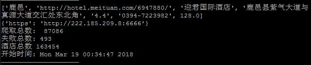
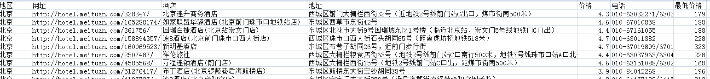
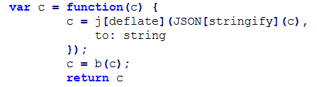
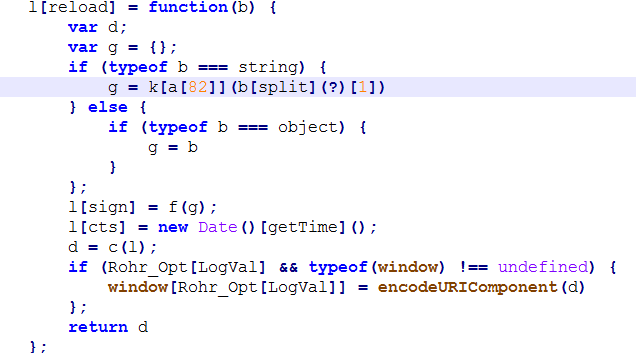
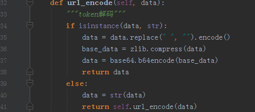

Python实现模拟美团_token验证并用多线程爬去酒店信息
==============
环境依赖
--------------
 * beautifulsoup
 * lxml
 * requests

运行方法
--------------
pip安装依赖
~~~
$ pip install -r requirments.txt
~~~

打开getproxy.py添加自己的代理池
默认使用了西刺免费代理，美团js验证容易被封，建议使用付费代理，顺便求靠谱代理池
~~~
$ python getproxy.py
~~~
爬取足够的代理ip
~~~
$ python run.py
~~~
运行:

20多万个酒店

数据
--------------

程序流程
--------------
选城市酒店列表的url为起点，爬取全国城市酒店列表网址，加入task队列，get_hotel_url爬取所有酒店网址，加入url队列，get_url_encode模拟js验证，run从url队列取出网址，爬取后存入datafile
断点续传

token验证
--------------
！
chrome查到异步提交的参数，全局搜索，反混淆找到js处理函数

python处理

perfect
